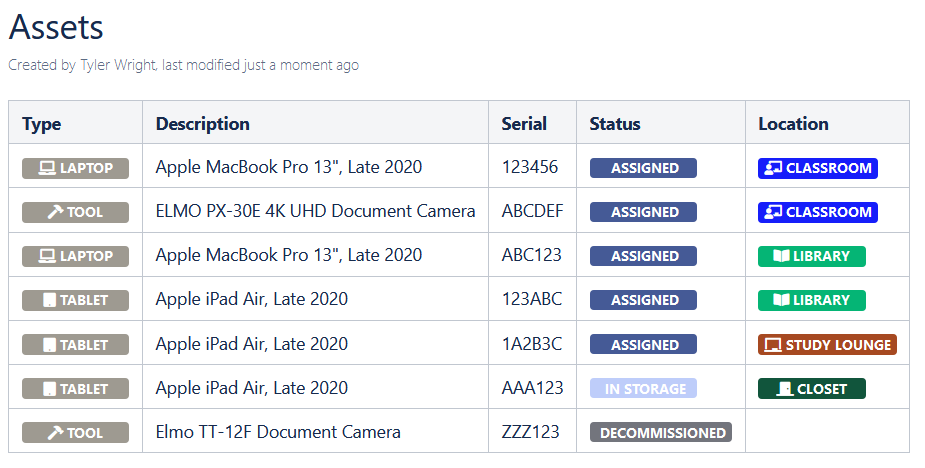
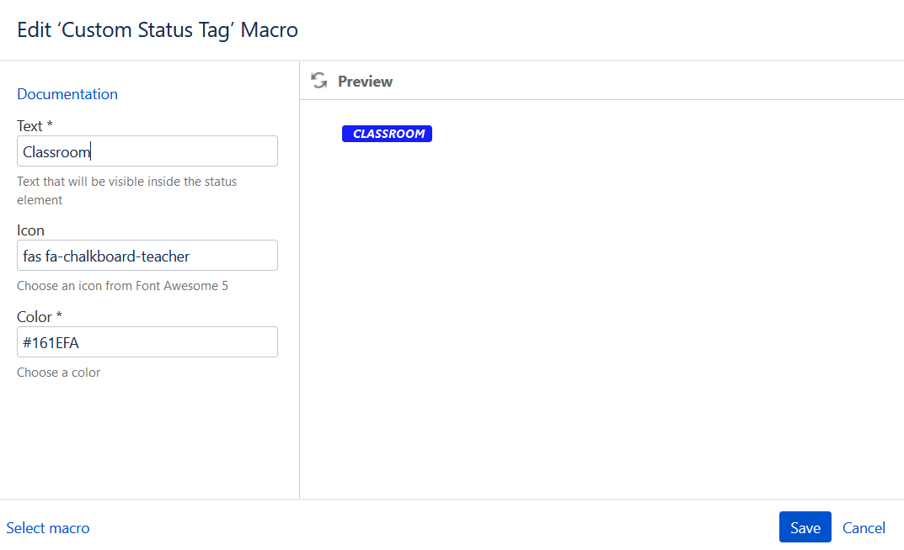
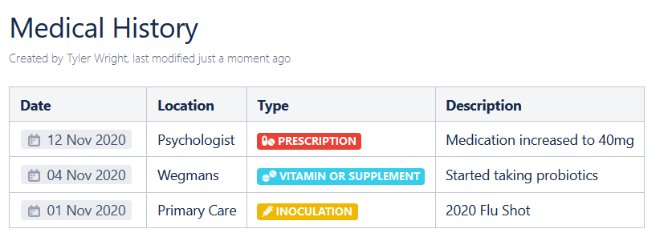

# confluence-custom-status-tag-macro
Custom status tags for Confluence.  User macro.  Font Awesome for icon support is optional.



## Installing
1. Login to Confluence.
2. Browse to _General Configuration_.
3. Under _Look and Feel_, select _Custom HTML_.
4. Click _Edit_.
5. Add the following stylesheet to the _at end of the HEAD_ section: 
    ```
    <link href="https://cdnjs.cloudflare.com/ajax/libs/font-awesome/5.15.1/css/all.min.css" rel="stylesheet">
    ```
6. Click _Save_.
7. Under _Configuration_, select _User Macros_.
8. Click _Create a User Macro_.
9. Set the following items:  
    | Key | Value |
    |------ | ------|
    | Name | custom_status_tag |
    | Visibility | All users |
    | Title | Custom Status Tag |
    | Categories | Formatting |
    | Documentation URL | https://github.com/tylwright/confluence-custom-status-tag-macro |
    | Body Processing | No macro body |
    | Template | Contents of maco file in this repo |
10. Click _Save_.

## Using



*Note:* Icons will not appear in preview.
1. Login to Confluence.
2. When editing a page, click the _+_ (_Insert more content_) button.
3. Select _Other macros_.
4. Under _Formatting_, select _Custom Status Tag_.
5. Set the following items:
    | Key | Value | Required? |
    | --- | --- | --- |
    | Text | The text that will be inside the pill/bubble/status object | Yes |
    | Icon | Icon from [Font Awesome's collection](https://fontawesome.com/icons?d=gallery) (ex. fas fa-hamburger) | No |
    | Color | Color name, hex, rgba, etc. (anything that CSS accepts) | Yes |
6. Click _Insert_.

## Other Examples
